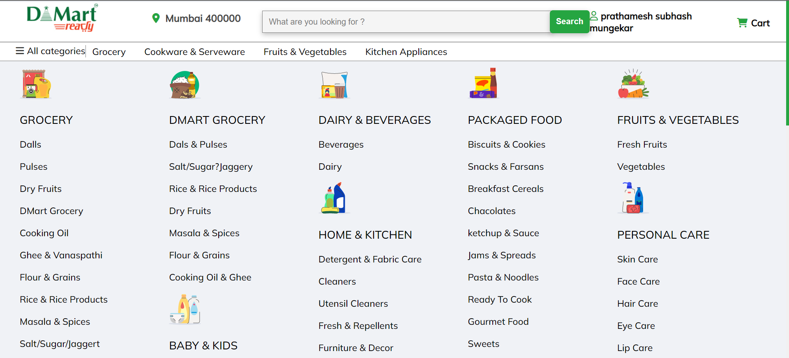
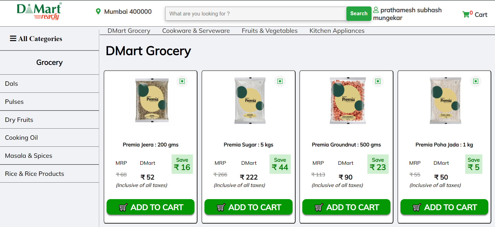
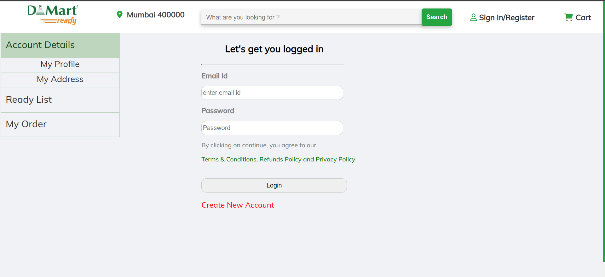
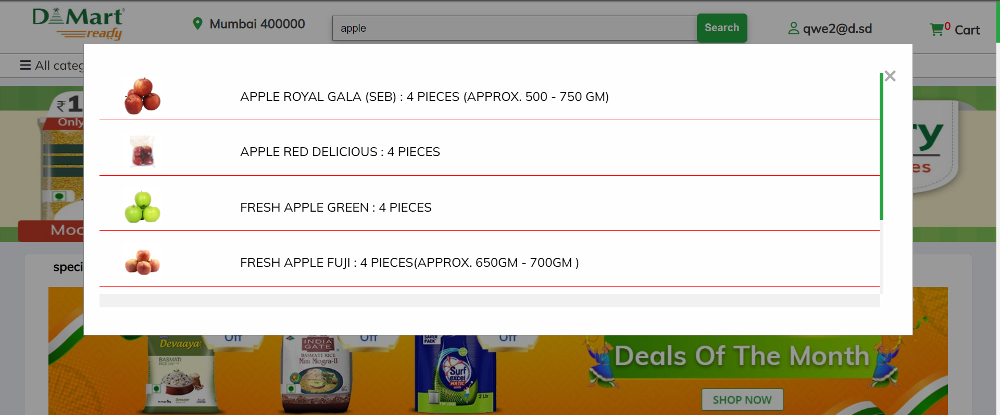
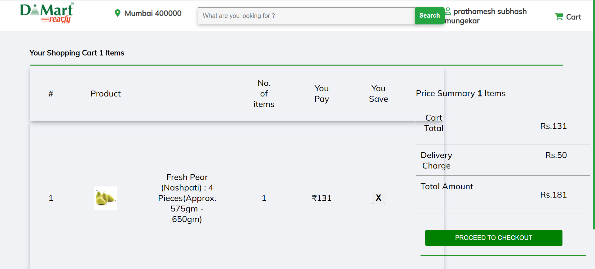
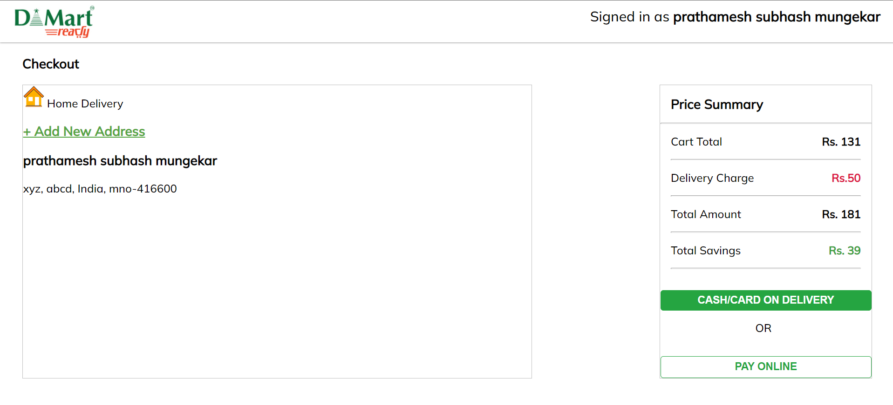
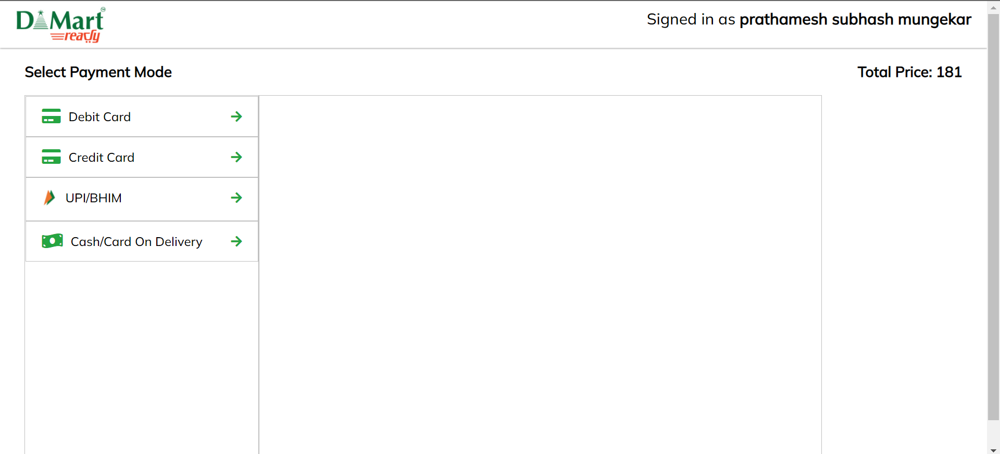
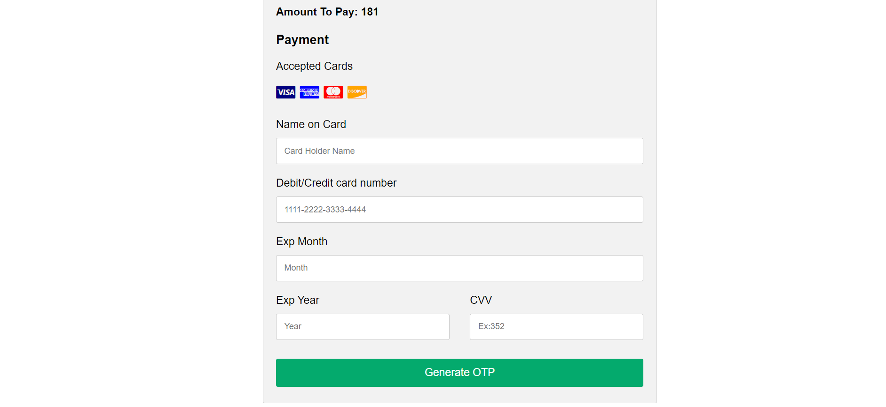
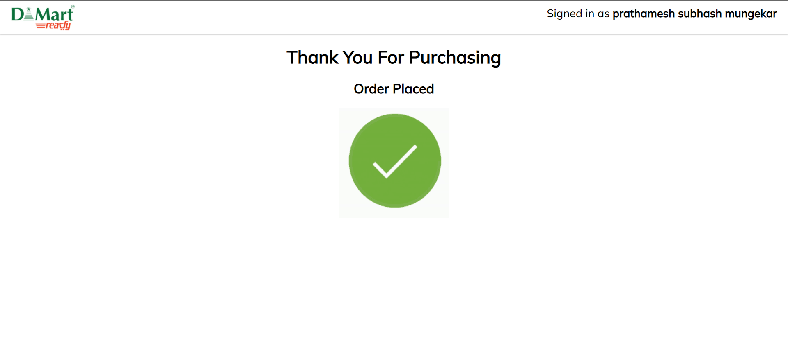

# D-Mart-with-backend
 
DMart Ready is a one-stop supermarket chain that aims to offer customers a wide range of basic home and personal products under one roof. 

This clone is made using EJS, HTML,CSS and Javascript Tech Stack.For backend we used MongoDb,ExpressJs,NodeJs and Mongoose. It was a group project of 4 members and executed in 6 days. 

#### Deployed Link - https://d-mart-clone.herokuapp.com

### Homepage

### ALL Categories

### Particular Categories

## Features

### Login Page

### Search Page

### Cart

### address

### Checkout

### Order Completion

## Thank You ✌
